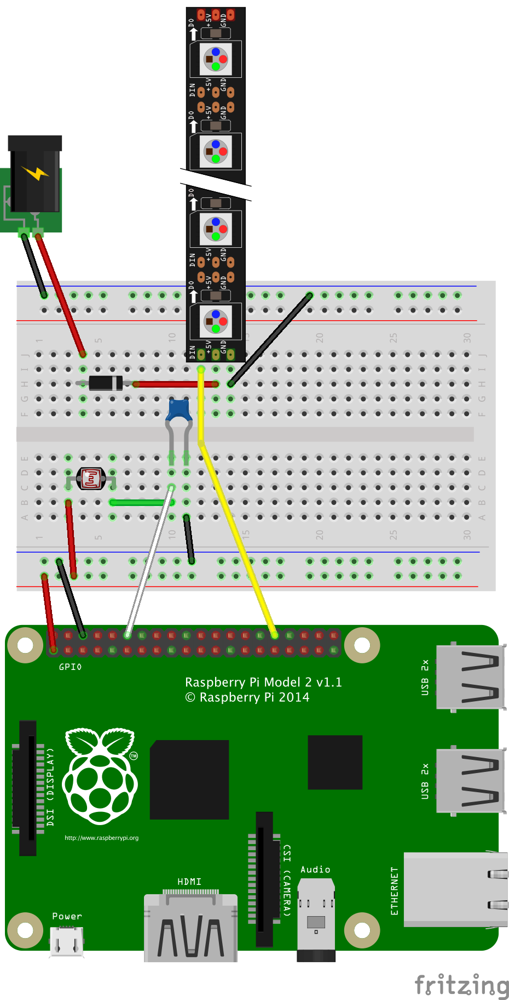

# donation-box-prototype

</img>

[Uses this for led control](https://learn.adafruit.com/neopixels-on-raspberry-pi/software)

[Uses this for reading photoresistor](https://learn.adafruit.com/basic-resistor-sensor-reading-on-raspberry-pi/basic-photocell-reading)
